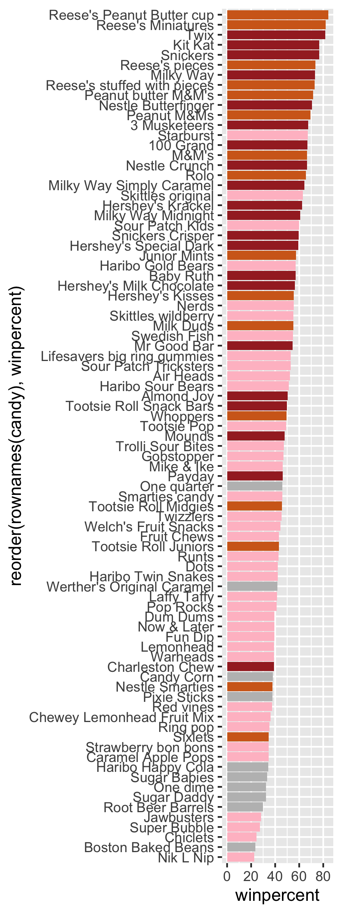

Todqy we will take a wee step back to some data we can taste and explore the correlation structure and principal components of some Halloween candy.

## Data Import

```{r}
candy_file <- "candy-data.csv"
candy = read.csv(candy_file, row.names=1)
head(candy)
```

> Q1. How many different candy types are in this dataset?

```{r}
nrow(candy)
```

> Q2. How many fruity candy types are in the dataset?

```{r}
sum(candy$fruity)
```

## 1. What is your favorite candy?

> Q3. What is your favorite candy in the dataset and what is it’s winpercent value?

```{r}
candy["Twix", ]$winpercent
```
```{r}
candy["Skittles", ]
View(candy)
```
> Q4. What is the winpercent value for “Kit Kat”?

```{r}
candy["Kit Kat", ]$winpercent
```

> Q5. What is the winpercent value for “Tootsie Roll Snack Bars”?

```{r}
candy["Tootsie Roll Snack Bars", ]$winpercent
```

## 2. Exploratory Analysis

We can use the **skimr** package to get a quick overview of a given dataset. This can be useful for the first time you encounter a new dataset.

```{r}
skimr::skim(candy)
```
> Q6. Is there any variable/column that looks to be on a different scale to the majority of the other columns in the dataset?

It looks like the last column `candy$winpercent` is on a different scale to all others.

> Q7. What do you think a zero and one represent for the candy$chocolate column?

```{r}
skimr::skim(candy$chocolate)
```
zero means the candy is not chocolate, one means the candy is chocolate.

> Q8. Plot a histogram of winpercent values

```{r}
hist(candy$winpercent)
```

```{r}
library(ggplot2)

ggplot(candy) +
  aes(winpercent) +
  geom_histogram(bins=10, fill="lightblue")
```

> Q9. Is the distribution of winpercent values symmetrical?

No.

> Q10. Is the center of the distribution above or below 50%?

```{r}
summary(candy$winpercent)
```
Median is below 50%. 

> Q11. On average is chocolate candy higher or lower ranked than fruit candy?

```{r}
choc.inds <- candy$chocolate == 1
choc.candy <- candy[choc.inds, ]
choc.win <- choc.candy$winpercent
mean(choc.win)
```
```{r}
fruit.win <- candy[ as.logical(candy$fruity), ]$winpercent
mean(fruit.win)
```

On average, chocolate candy is higher ranked than fruit candy.

> Q12. Is this difference statistically significant?

```{r}
ans <- t.test(choc.win, fruit.win)
ans
```

Yes, there is a statistically different with a p-value of `r ans$p.value`.
```{r}
ans$p.value
```

## 3. Overall Canday Rankings

> Q13. What are the five least liked candy types in this set?

There are two related functions that can help here, one is the classic `sort()` and `order()`. 

```{r}
x <- c(5,10,1,4)
sort(x, decreasing = T)
```
```{r}
order(x)
```
```{r}
inds <- order(candy$winpercent)
head( candy[inds, ], 5)
```

> Q14. What are the top 5 all time favorite candy types out of this set?

```{r}
tail( candy[inds, ], 5)
```
```{r}
inds <- order(candy$winpercent, decreasing = T)
head( candy[inds, ], 5)
```

> Q15. Make a first barplot of candy ranking based on winpercent values.
Make a bar plot with ggplot and order it by winpercent values

```{r}
ggplot (candy) +
  aes(winpercent, rownames(candy)) +
  geom_col()
```
>. Q16. This is quite ugly, use the reorder() function to get the bars sorted by winpercent?

```{r}
ggplot (candy) +
  aes(winpercent, reorder(rownames(candy),winpercent)) +
  geom_col()
```
```{r}
ggplot (candy) +
  aes(winpercent, reorder(rownames(candy),winpercent)) +
  geom_col(fill="red")
```
```{r}
ggplot (candy) +
  aes(x= winpercent, y=reorder(rownames(candy),winpercent), fill=chocolate) +
  geom_col()

```

Here we want a custom color vector to color each bar the way we want with `chocolate` and `fruity` candy together with whether it is `bar` or not

```{r}

mycols <- rep("gray", nrow(candy))
mycols[as.logical(candy$chocolate)] <- "chocolate"
mycols[as.logical(candy$fruity)] <-"pink"
mycols[as.logical(candy$bar)] <- "brown"

#mycols
ggplot (candy) +
  aes(winpercent, reorder(rownames(candy),winpercent)) +
  geom_col(fill=mycols)

ggsave("mybarplot.png", width=3, height=8)
```



> Q17. What is the worst ranked chocolate candy?

Sixlets

> Q18. What is the best ranked fruity candy?

Starburst

## 4. Winpercent vs Pricepercent

```{r}
# Pink and gray are too light. lets change to red and black
mycols <- rep("black", nrow(candy))
mycols[as.logical(candy$chocolate)] <- "chocolate"
mycols[as.logical(candy$fruity)] <-"red"
mycols[as.logical(candy$bar)] <- "brown"

library(ggrepel)

# How about a plot of price vs win
ggplot(candy) +
  aes(winpercent, pricepercent, label=rownames(candy)) +
  geom_point(col=mycols) + 
  geom_text_repel(col=mycols, size=3.3, max.overlaps = 8)
```
>. Q19. Which candy type is the highest ranked in terms of winpercent for the least money - i.e. offers the most bang for your buck?

```{r}
ord <- order(candy$pricepercent, decreasing = TRUE)
tail( candy[ord,c(11,12)], n=5 )
```

>. Q20. What are the top 5 most expensive candy types in the dataset and of these which is the least popular?

```{r}
ord <- order(candy$pricepercent, decreasing = TRUE)
head( candy[ord,c(11,12)], n=5 )
```

## 5. Correlation Structure

```{r}
cij <- cor(candy)
cij
```

```{r}
library(corrplot)

corrplot(cij)
```

> Q22. Examining this plot what two variables are anti-correlated (i.e. have minus values)?

Chocolate and fruity are negatively correlated 

```{r}
round( cij["chocolate", "fruity"], 2)
```

> Q23. Similarly, what two variables are most positively correlated?

```{r}

```

## 6. Principle Component Analysis (PCA)

We need to be sure to scale our input `candy` data before PCA as we have the `winpercent` column on a different scale to all others in the dataset.

```{r}
pca <- prcomp(candy, scale=T)
summary(pca)
```

First main result figutr is my "PCA plot"

```{r}
#pca$x
ggplot(pca$x) +
  aes(PC1, PC2, label=rownames(pca$x)) +
  geom_point(col=mycols) +
  geom_text_repel(max.overlaps =6, col=mycols) + 
  theme_bw()
```

The second main PCA result is in the `pca$rotation` we can plot this to generate a so-called "loadings" plot. 

```{r}
#pca$rotation
ggplot(pca$rotation) +
  aes(PC1, reorder(rownames(pca$rotation), PC1), fill=PC1) +
  geom_col()
```

>. Q24. What original variables are picked up strongly by PC1 in the positive direction? Do these make sense to you?

Fruity, pluribus, and hard. It makes sense to me because fruity and hard candy are popular. 


