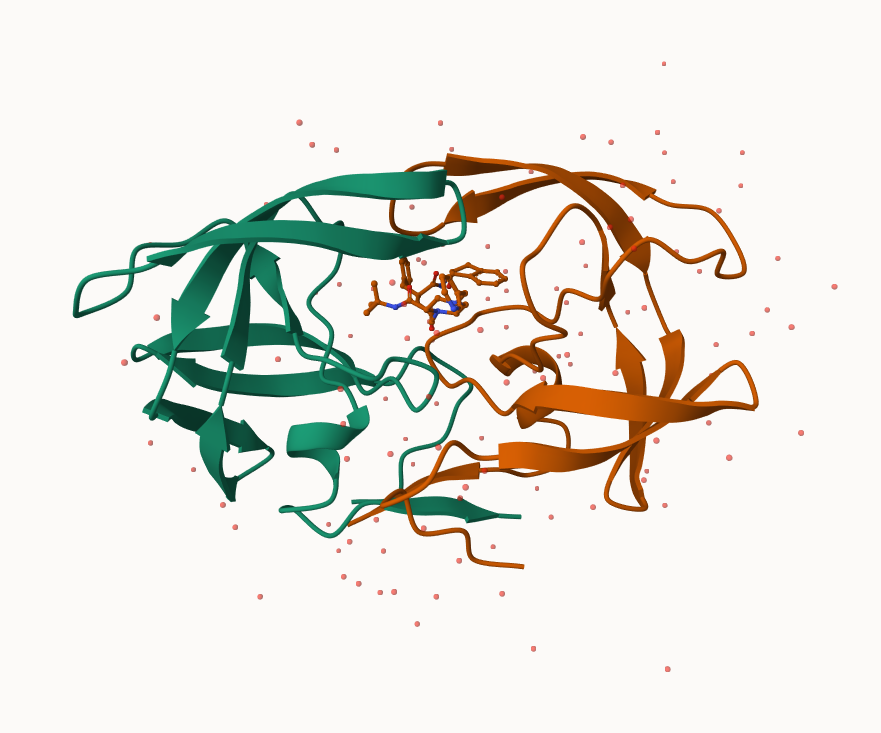
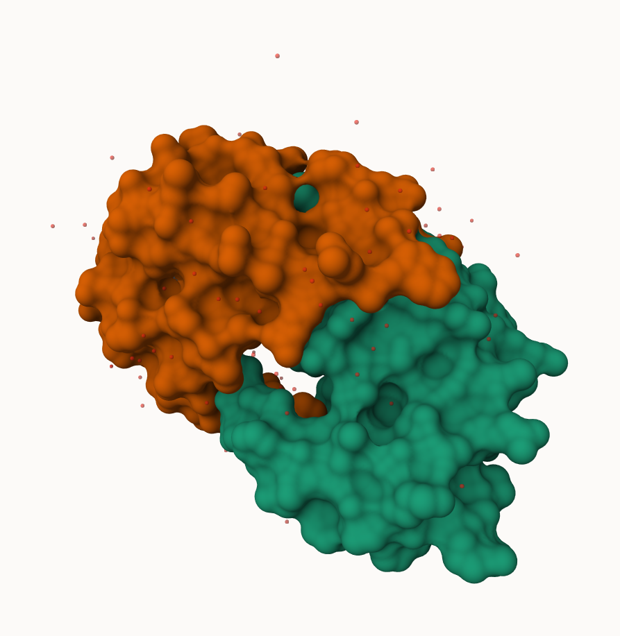
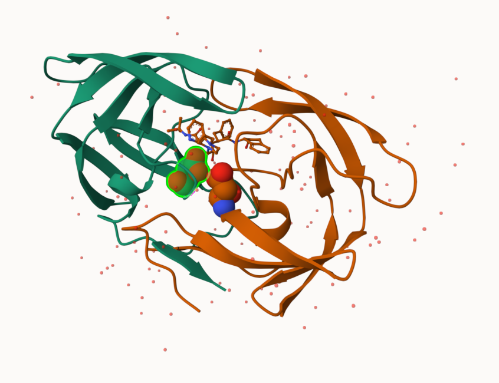

## 1. The PDB Database

The main repository of biomolecular structure data is called the [Protein Data Bank](https://www.rcsb.org/) (PDB for short). It is the second oldest database (after GenBank). 

What is currently in the PDB ? We can access current composition stats [here](https://www.rcsb.org/stats)

```{r}
stats <- read.csv("Data Export Summary.csv", row.names = 1)
head(stats)
```

> Q1: What percentage of structures in the PDB are solved by X-Ray and Electron Microscopy.

```{r}
stats$X.ray
as.numeric(stats$X.ray)
```

```{r}
x <- stats$X.ray

# Substitude comma for nothing
y <- gsub(",", "", x) 

# convert to numeric
sum(as.numeric(y))
```
Turn this snippet into a function so I can use it any time I have this comma problem (i.e. the other columns of this `stats` table). 

```{r}
comma.sum <- function(x) {

  # Substitude comma for nothing
  y <- gsub(",", "", x) 

  # convert to numeric
  return( sum(as.numeric(y)) )
}
```

```{r}
xray.sum <- comma.sum(stats$X.ray)
em.sum <- comma.sum (stats$EM)
total.sum <- comma.sum (stats$Total)
```

```{r}
xray.sum/total.sum * 100
```

```{r}
em.sum/total.sum * 100
```

> Q2: What proportion of structures in the PDB are protein?

```{r}
protein.rows <- stats[ c("Protein (only)", "Protein/Oligosaccharide", "Protein/NA"),]
protein.sum <- comma.sum(protein.rows$Total)
total.sum <- comma.sum (stats$Total)
protein.sum/ total.sum
```

> Q3: Type HIV in the PDB website search box on the home page and determine how many HIV-1 protease structures are in the current PDB?

1149 HIV-1 protease structures are in the current PDB.

## 2. Visualizing with Mol-star

Explore the HIV-1 protease structure with PDB code `1HSG`
Mol-star homepage at: https://molstar.org/viewer/. 







## 3. Using the bio3d package in R

The Bio3D package is focused on structural bioinformatics analysis and allows us to read and analyze PDB (and related) data. 

```{r}
library(bio3d)
```

```{r}
pdb <- read.pdb("1hsg")
pdb
```

```{r}
attributes(pdb)
```

We can see atom data with `pdb$atom`
```{r}
head(pdb$atom)
```

```{r}
head( pdbseq(pdb) )
```

## 4. Molecular Visualization in Art
We can make quick 3D viz with the `view.pdb()` function:

```{r}
library(bio3dview)
library(NGLVieweR)

#view.pdb(pdb, backgroundColor = "pink", colorScheme = "see")
```

```{r}
library(bio3d)
sel <- atom.select(pdb, resno = 25)

#view.pdb(pdb, cols=c("green", "orange"), highlight =sel ) 
```

## 5. Predicating functional motions of a single structure

We can finish off today with a bioinformatics prediction pf the functional motions of a protein.

We will run a Normal Mode Analysis (NMA) 

```{r}
adk <- read.pdb("6s36")
adk
```

```{r}
m <- nma(adk)
plot(m)
```

```{r}
#view.nma(m)
```

We can write out a trajectory of the predicted dynamics and view this in Mol-star

```{r}
mktrj(m, file="nma.pdb")
```


